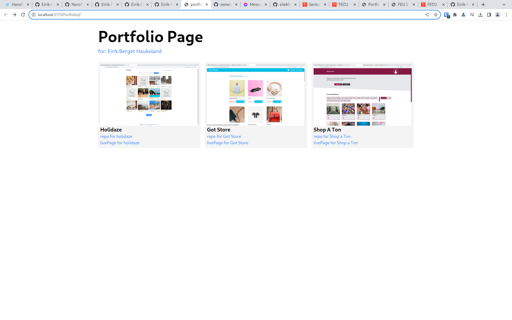

# [Portfolio Page](https://github.com/Eirik-Haukeland/Portfolio2)

[](https://eirik-haukeland.github.io/Portfolio2/)

## Description

this is a portfolio page containing 3 of my newer projects

it lists them as cards along with:
- an image
- a title
- desctription
- link to the repository
- link to the site running

## Built with

- [tailwindcss](https://tailwindcss.com/)
- [svelte](https://svelte.dev/)
- [vite](https://vitejs.dev/)
- [github pages](https://pages.github.com/)

## Getting Started

### installing

first clone the repo
```shell
git clone git@github.com:Eirik-Haukeland/Portfolio2.git
```

then install the depenencies
```shell
npm install
```

### running

```shell
npm run dev
```
## Contributing

this project is not beeing activly developped, but if you want to suggest canges please open an issue where you describe the problem you want to solve and the proposed sulution. submitt the changes to a pr and link the pr to the issue

## Acknowledgments

- [vite-deploy-demo](https://github.com/sitek94/vite-deploy-demo?tab=readme-ov-file) for the deployment workflow to publish the build to github pages.
